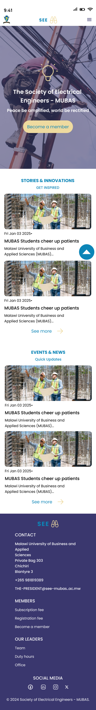

## SEE WEBSITE STYLES

### Colors
1. Light Blue: #0C85B7
2. Dark Blue: #3A376E
3. Yellow : #EEDA9F
4. White : #FFFFFF
5. feint white : #F5F5F5
6. Black : #000000
7. Green : #0DA740

### Linear Gradient
Yellow: #EEDA9F & Blue: #06587A, to bottom:

### Font Family
#### Poppins
@import url('https://fonts.googleapis.com/css2?family=Anonymous+Pro:ital,wght@0,400;0,700;1,400;1,700&family=DM+Mono:ital,wght@0,300;0,400;0,500;1,300;1,400;1,500&family=Hanken+Grotesk:ital,wght@0,100..900;1,100..900&family=Poppins:ital,wght@0,100;0,200;0,300;0,400;0,500;0,600;0,700;0,800;0,900;1,100;1,200;1,300;1,400;1,500;1,600;1,700;1,800;1,900&family=Roboto:ital,wght@0,100;0,300;0,400;0,500;0,700;0,900;1,100;1,300;1,400;1,500;1,700;1,900&display=swap');

### Mobile Device
#### Font Sizes
1. 24px, font weight: semi bold
2. 18px, font weight: semi bold
3. 18px, font weight: Medium
4. 15px, font weight: Regular
5. 13px, font weight: Regular

#### Icon Sizes
1. Large: 65px
2. Medium: 35px
3. Small: 24px

### Design Preview
.